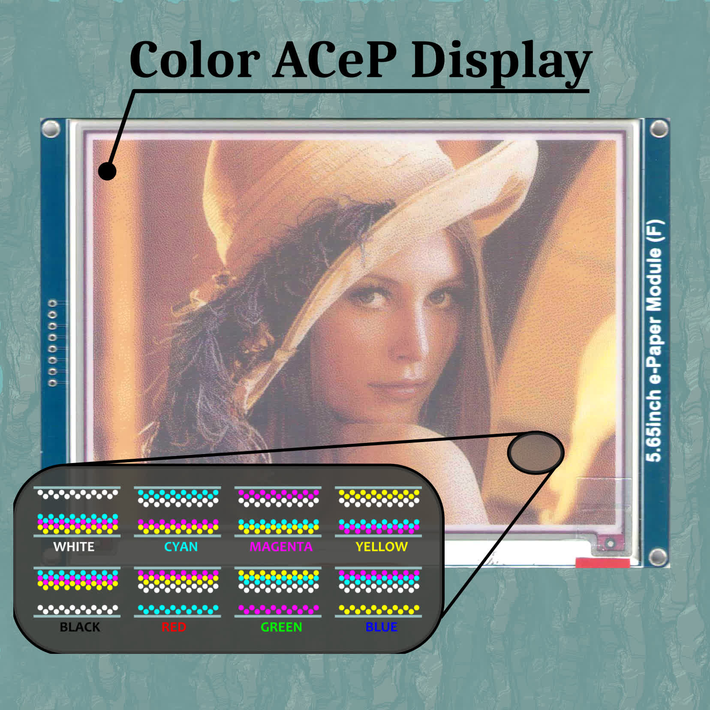

# Understanding ACeP Tecnology

<!-- TABLE OF CONTENTS -->

  
Table of Contents

  <ol>
    <li>
      <a href="#about-the-project">About The Project</a>
    </li>
    <li>
      <a href="#getting-started">Getting Started</a>
      <ul>
        <li><a href="#prerequisites">Prerequisites</a></li>
        <li><a href="#compiling">Compiling</a></li>
      </ul>
    </li>
    <li><a href="#circuit-diagram">Circuit Diagram</a></li>
  </ol>

<!-- ABOUT THE PROJECT -->
## About The Project
This project is about the design of custom LUTs to drive ACeP displays.
The demo application targets an STM32F4 Discovery board connected to this [e-paper display](https://www.waveshare.com/5.65inch-e-paper-module-f.htm).

For more info check out the [full log on hackaday.io](https://hackaday.io/project/179058-understanding-acep-tecnology)

<!-- GETTING STARTED -->
## Getting Started
### Prerequisites
* [STM32CubeIDE 1.3.0](https://www.st.com/en/development-tools/stm32cubeide.html)

### Compiling
* Open STM32CubeIDE
* Select a folder as workspace (this can be any folder in your hard-drive)
* Click on `File > Import`
* Select `General > Existing Project into Workspace` then click next
* Browse for the folder `stm32` select the project and click finish

<!-- CIRCUIT DIAGRAM -->
## Circuit Diagram
| STM32F4 Discovery | Display |
|:-----------------:|:-------:|
|        PA.7       |  MOSI   |
|        PA.5       |  CLK    |
|        PD.5       |  CS     |
|        PD.4       |  DC     |
|        PB.7       |  BUSY   |
|        PB.4       |  RST    |
|        PA.3       |  MFCSB* |
|        PA.6       |  MFSDO* |

\* MFCSB and MFSDO are optional, only needed to read from FLASH.
