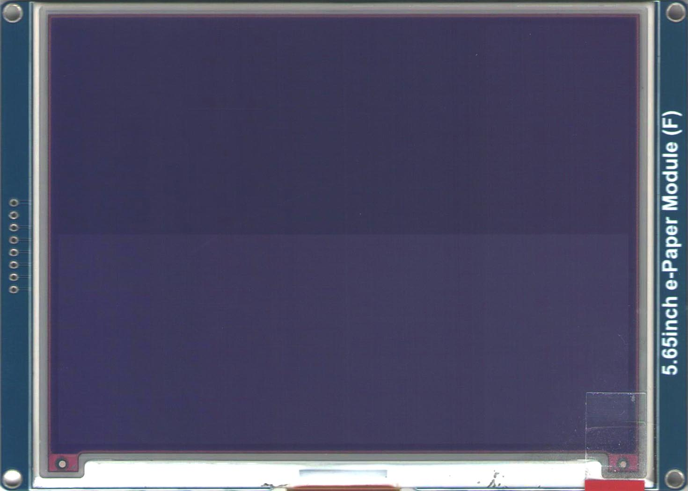
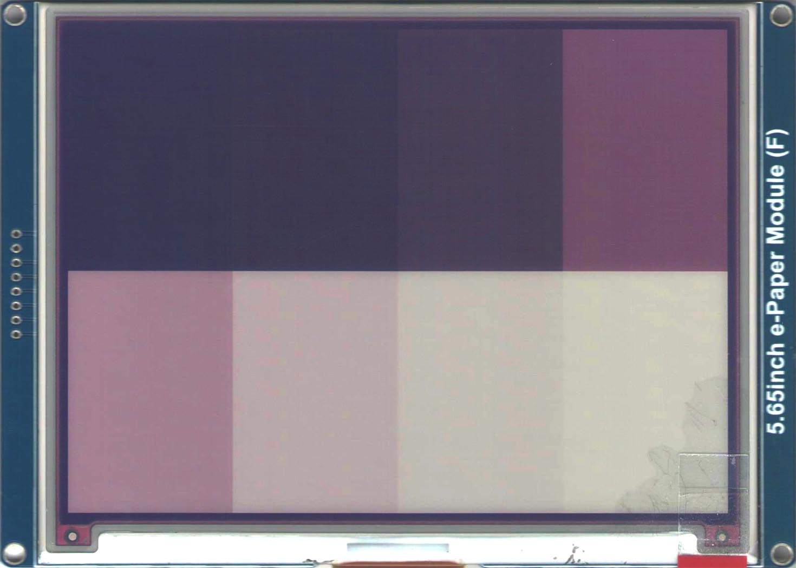
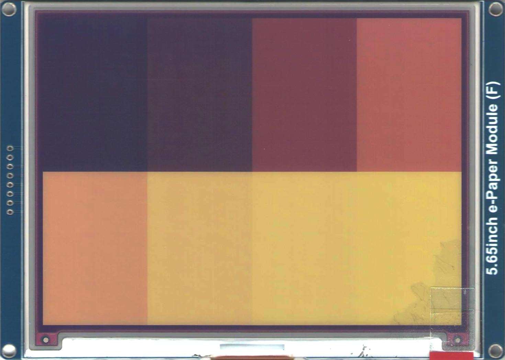
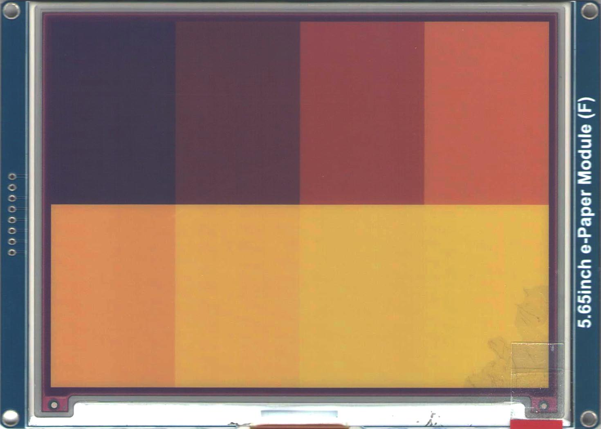
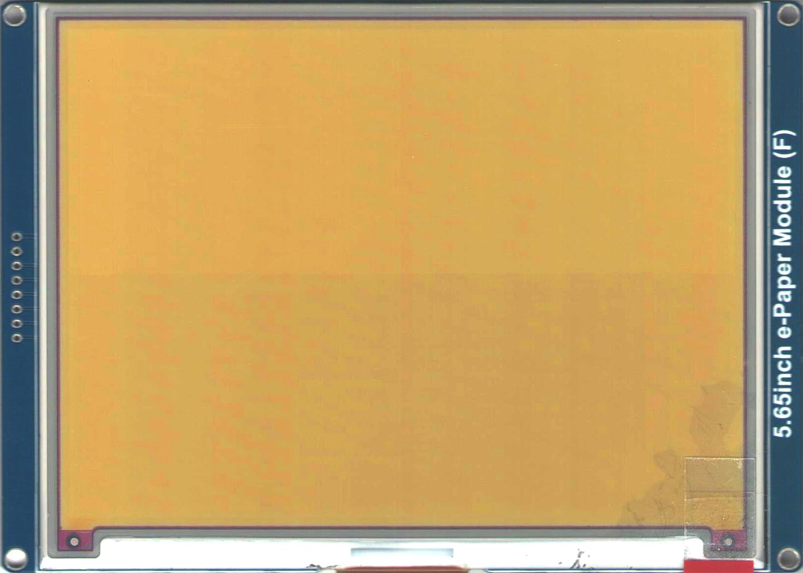
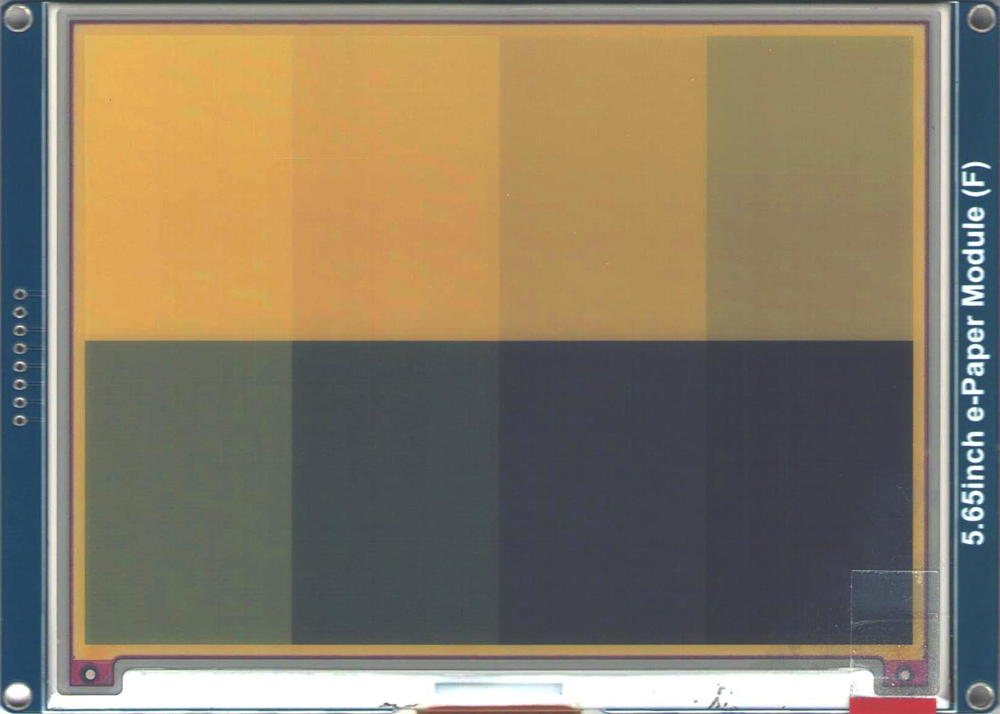
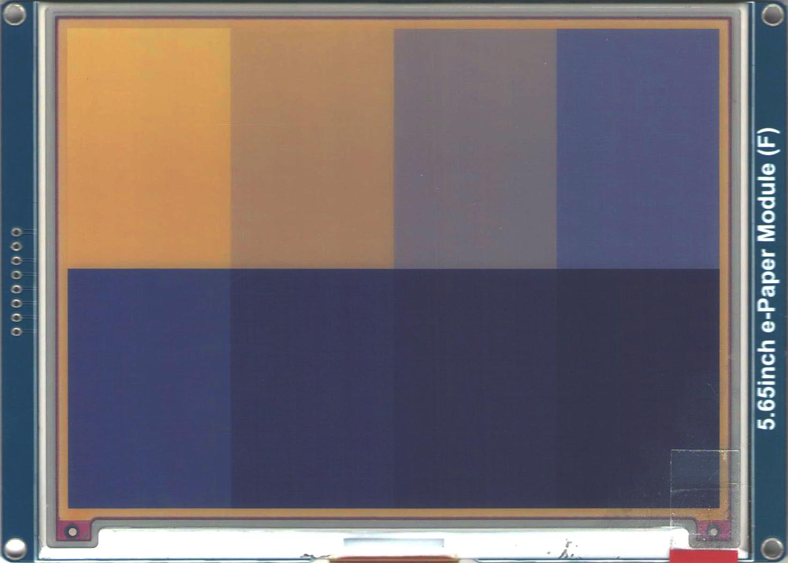
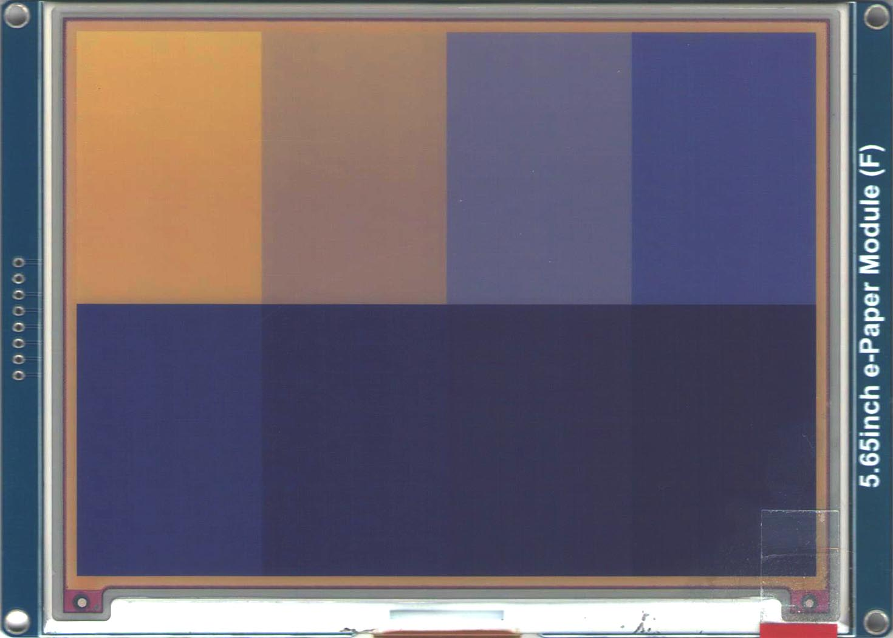

# Test waveforms

<!-- TABLE OF CONTENTS -->

  
Table of Contents

  <ol>
    <li><a href="#positive-step">Positive step</a></li>
    <li><a href="#negative-step">Negative step</a></li>
    <li><a href="#notes">Notes</a></li>
  </ol>

<!-- POSITIVE STEP -->
## Positive step
This set of waveforms applies a positive step voltage
with amplitude V (5 15 25 30) for x (2 4 8 16 32 64 128 255) frames

    +30V |                            _____       __________              ^^
    +25V |                           |     |     |          |             ||
    +15V |                           |     |     |          |           ******
     +5V |                           |     |     |          |          |  ||  |
      0V |--------------------+  ^^  |     |     |          |          |  vv  +--------------------
     -5V |                    |  ||  |     |     |          |          |
    -15V |                     ******      |     |          |          |
    -25V |                       ||        |     |          |          |
    -30V |                       vv        |_____|          |__________|

          <------------------> <----> <---> <---> <--------> <--------> <----> <------------------>
    Frames:      255-x            x     50    50      100        100       x         255-x
    Voltage:       0             -V    +30   -30      +30        -30       V           0

 Positive 5V step               | Positive 15V step
:------------------------------:|:------------------------------:
 | 

 Positive 25V step                | Positive 30V step
:--------------------------------:|:--------------------------------:
 | 

<!-- NEGATIVE STEP -->
## Negative step
This set of waveforms applies a negative step voltage
with amplitude V (-5 -15 -25 -30) for x (2 4 8 16 32 64 128 255) frames

    +30V |                       ^^         _____            __________
    +25V |                       ||        |     |          |          |
    +15V |                     ******      |     |          |          |
     +5V |                    |  ||  |     |     |          |          |
      0V |--------------------+  vv  |     |     |          |          |  ^^  +--------------------
     -5V |                           |     |     |          |          |  ||  |
    -15V |                           |     |     |          |           ******
    -25V |                           |     |     |          |             ||
    -30V |                           |_____|     |__________|             vv
    
          <------------------> <----> <---> <---> <--------> <--------> <----> <------------------>
    Frames:     255-x            x     50    50      100        100       x         255-x
    Voltage:     0               V    -30   +30      -30        +30      -V          0

 Negative 5V step               | Negative 15V step
:------------------------------:|:------------------------------:
 | 

 Negative 25V step                | Negative 30V step
:--------------------------------:|:--------------------------------:
 | 

<!-- NOTES -->
## Notes
Testing done at 21°C